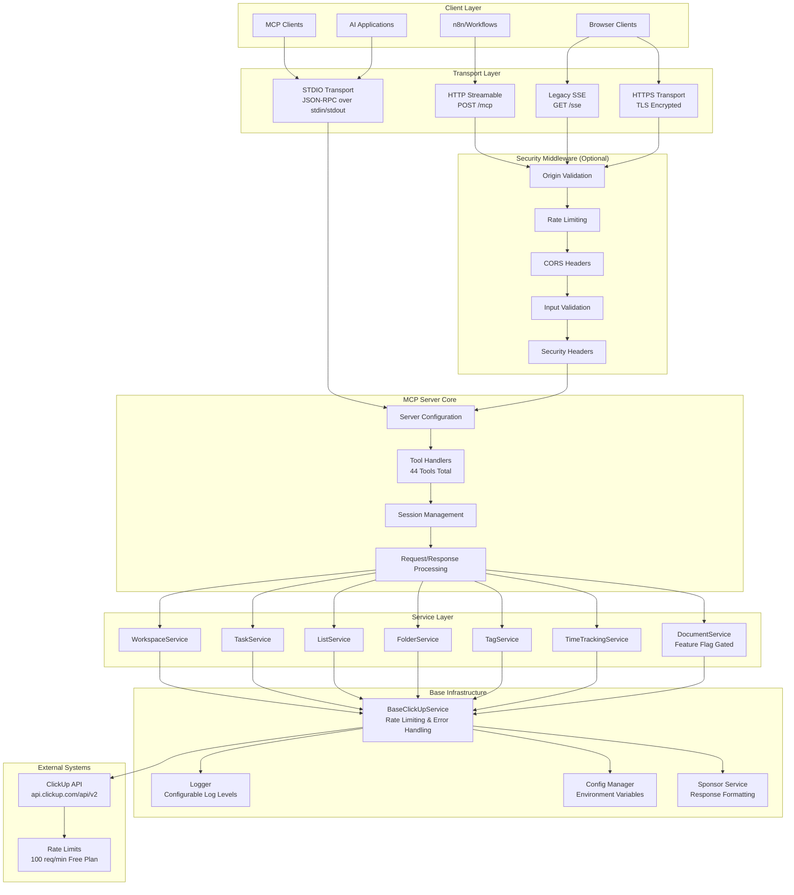
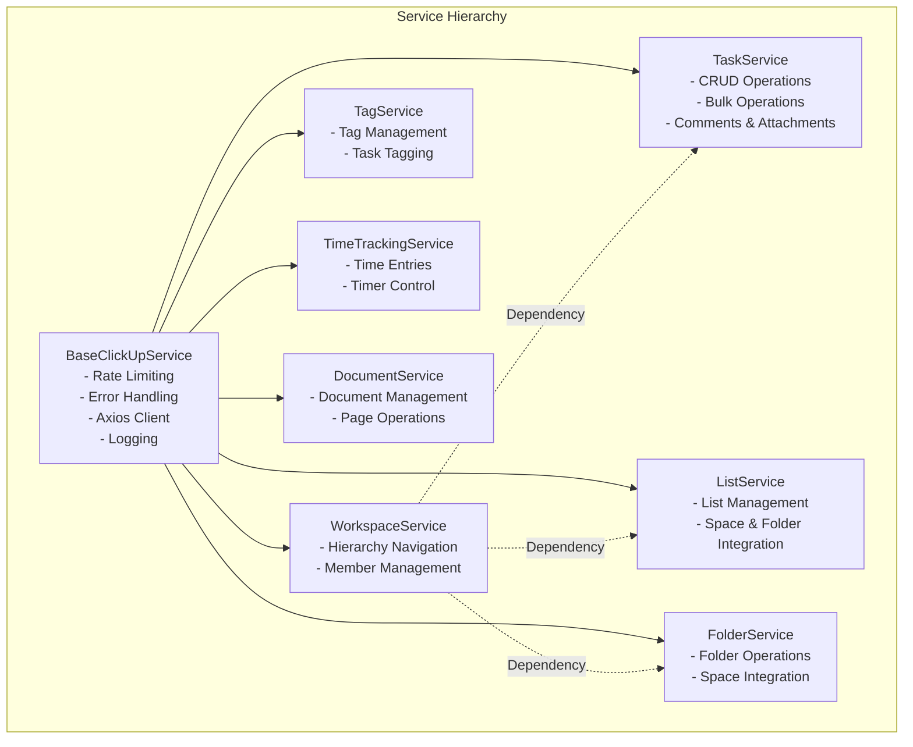

# ClickUp MCP Server - Comprehensive Analysis Report

## Executive Summary

The ClickUp MCP Server is a well-architected Node.js application implementing the Model Context Protocol (MCP) v1.11.3 to enable AI interactions with ClickUp workspaces. The codebase demonstrates mature engineering practices with comprehensive tool coverage (44 tools vs. advertised 36), multiple transport mechanisms, and robust error handling. The architecture has undergone significant optimization, achieving a claimed **70% codebase reduction** through unified architecture patterns and elimination of code duplication.

**Key Strengths:**
- Comprehensive ClickUp API coverage with natural language date parsing
- Multiple transport protocols (STDIO, HTTP Streamable, Legacy SSE)  
- Optional security features (HTTPS, rate limiting, CORS, origin validation)
- Well-structured service layer with proper error handling
- Mature build process with TypeScript and Docker support

**Key Concerns:**
- Tool count discrepancy (44 vs. 36 advertised)
- Optional security features disabled by default
- Complex configuration matrix across multiple transport types
- Missing formal API documentation beyond README

**Overall Assessment:** Production-ready with minor documentation and security hardening recommendations.

---

## Architecture Overview Diagram



---

## Transport & Configuration Matrix

| Transport Type | Default Port | Activation | Endpoints | Security Features | Use Case |
|---|---|---|---|---|---|
| **STDIO** | N/A | `ENABLE_SSE=false` | stdin/stdout | None | AI agents, CLI tools |
| **HTTP Streamable** | 3231 | `ENABLE_SSE=true` | `POST /mcp`, `GET /mcp`, `DELETE /mcp` | All optional middleware | MCP Inspector, modern clients |
| **Legacy SSE** | 3231 | `ENABLE_SSE=true` | `GET /sse`, `POST /messages` | All optional middleware | n8n, backward compatibility |
| **HTTPS** | 3443 | `ENABLE_HTTPS=true` | Same as HTTP + TLS | All + HSTS headers | Production, encrypted clients |

### Key Configuration Variables

| Category | Variable | Default | Purpose |
|---|---|---|---|
| **Core** | `CLICKUP_API_KEY` | Required | ClickUp API authentication |
| **Core** | `CLICKUP_TEAM_ID` | Required | Target workspace |
| **Features** | `DOCUMENT_SUPPORT` | `false` | Enable document management tools |
| **Transport** | `ENABLE_SSE` | `false` | Enable HTTP/SSE transports |
| **Transport** | `PORT` | `3231` | HTTP server port |
| **Security** | `ENABLE_SECURITY_FEATURES` | `false` | Master security toggle |
| **Security** | `ENABLE_HTTPS` | `false` | HTTPS/TLS support |
| **Security** | `ENABLE_ORIGIN_VALIDATION` | `false` | Origin whitelist validation |
| **Security** | `ENABLE_RATE_LIMIT` | `false` | DoS protection |
| **Tools** | `ENABLED_TOOLS` | All enabled | Comma-separated tool whitelist |
| **Tools** | `DISABLED_TOOLS` | None disabled | Comma-separated tool blacklist |

---

## Tool Catalogue

### Summary by Category (44 Total Tools)

| Category | Count | Description |
|---|---|---|
| **Task Management** | 14 | CRUD operations, bulk operations, comments, attachments |
| **Workspace Navigation** | 1 | Hierarchical workspace structure |
| **List Management** | 5 | List lifecycle in spaces and folders |
| **Folder Management** | 4 | Folder organization within spaces |
| **Tag Management** | 6 | Space tags and task tagging |
| **Time Tracking** | 6 | Time entries, start/stop tracking |
| **Member Management** | 3 | User resolution and assignment |
| **Document Management** | 6 | Document and page management (feature-gated) |
| **File Attachments** | 1 | File attachment to tasks |

### Critical Tools Analysis

**High-Impact Tools:**
- `get_workspace_hierarchy` - Essential for AI navigation
- `create_task`, `update_task`, `get_task` - Core task management
- `get_workspace_tasks` - Cross-workspace task queries with filtering
- `create_bulk_tasks`, `update_bulk_tasks` - Efficient batch operations

**Feature-Gated Tools (7 tools):**
- All document management tools require `DOCUMENT_SUPPORT=true`
- Represents 16% of total tool suite

**Tool Filtering:**
- `ENABLED_TOOLS` takes precedence over `DISABLED_TOOLS`
- Useful for client context limitations or security restrictions

---

## Services Layer Analysis

### Service Architecture Pattern



### Base Service Features

**Rate Limiting Strategy:**
- Default: 600ms spacing between requests
- Configurable based on ClickUp plan limits
- Queue-based request management
- Adaptive spacing based on rate limit headers

**Error Handling:**
- Comprehensive error code enumeration (12 error types)
- Context-aware error logging
- Custom `ClickUpServiceError` class
- Automatic retry logic for rate limits

**Request Management:**
- 65-second timeout (under ClickUp's 1-minute window)
- JSON response parsing with fallback
- Request queuing with processing flags
- Axios interceptors for consistent error handling

### Service Dependencies

- **Workspace Service**: Foundation service used by Task, List, and Folder services
- **Shared Configuration**: All services use centralized config and logging
- **Singleton Pattern**: Services created once via `createClickUpServices()` factory
- **Cross-Service Communication**: Services can access shared workspace data

---

## Security Assessment

### Current Security Posture

**Strengths:**
- ✅ All security features are opt-in (backward compatibility)
- ✅ Comprehensive middleware stack available
- ✅ HTTPS/TLS support with proper certificate handling
- ✅ Rate limiting with configurable thresholds
- ✅ Origin validation with whitelist support
- ✅ Input validation and request size limits
- ✅ Security headers (HSTS, XSS protection, etc.)

**Weaknesses:**
- ⚠️ **Security disabled by default** - requires explicit enablement
- ⚠️ Self-signed certificates generate browser warnings
- ⚠️ No authentication layer beyond ClickUp API key
- ⚠️ Missing request signing or API versioning
- ⚠️ No audit logging for security events

### Security Configuration Levels

**Level 1 - Basic (Recommended Minimum):**
```bash
ENABLE_SECURITY_FEATURES=true
ENABLE_ORIGIN_VALIDATION=true
```

**Level 2 - Production (Recommended):**
```bash
ENABLE_SECURITY_FEATURES=true
ENABLE_HTTPS=true
ENABLE_ORIGIN_VALIDATION=true  
ENABLE_RATE_LIMIT=true
SSL_CERT_PATH=/path/to/cert.pem
SSL_KEY_PATH=/path/to/key.pem
```

**Level 3 - Hardened:**
```bash
# Level 2 plus:
ENABLE_CORS=true
MAX_REQUEST_SIZE=5mb
RATE_LIMIT_MAX=50
ALLOWED_ORIGINS="https://trusted-domain.com"
```

### Security Recommendations

1. **Enable Security by Default**: Consider making basic security features default-enabled
2. **Add Authentication Layer**: Implement API key validation beyond ClickUp credentials  
3. **Certificate Management**: Provide Let's Encrypt integration for production deployments
4. **Audit Logging**: Add comprehensive security event logging
5. **Request Signing**: Implement request signing for enhanced API security

---

## Build & Dependency Notes

### Build System

**TypeScript Configuration:**
- Target: ES2020 with NodeNext modules
- Strict mode: Disabled (relaxed for flexibility)
- Output: `build/` directory
- Module resolution: NodeNext for proper ESM support

**Build Process:**
```bash
1. TypeScript compilation: tsc
2. Permissions: chmod 755 on build/index.js  
3. Dependencies: Production dependencies only in final package
```

**Docker Multi-stage:**
- Builder stage: Node 18 Alpine with full build tools
- Runtime stage: Node 18 Alpine with compiled output only
- Optimized for size with minimal attack surface

### Dependencies Analysis

**Core Dependencies (7):**
- `@modelcontextprotocol/sdk@^1.11.3` - MCP protocol implementation
- `axios@^1.6.7` - HTTP client for ClickUp API
- `express@^5.1.0` - HTTP server for SSE/HTTP transports
- `cors@^2.8.5` - CORS middleware
- `dotenv@^16.5.0` - Environment variable management
- `zod@^3.23.8` - Schema validation
- `express-rate-limit` (implied) - Rate limiting middleware

**Development Dependencies (4):**
- TypeScript compiler and type definitions
- Minimal development footprint

**Node.js Requirements:**
- Version: >=18.0.0 <23.0.0
- Rationale: MCP SDK compatibility requirements

### Dependency Risk Assessment

**Low Risk:**
- All dependencies are well-maintained with regular updates
- No known high-severity vulnerabilities in current versions
- Conservative version pinning strategy

**Recommendations:**
- Regular `npm audit` checks
- Automated dependency updates via Dependabot/Renovate
- Consider `npm shrinkwrap` for production deployments

---

## Observed Strengths

### 1. **Architectural Excellence**
- **Unified Architecture**: Single codebase serving multiple transport types
- **Service Layer Pattern**: Clear separation of concerns with shared base classes
- **Error Handling**: Comprehensive error taxonomy with context-aware logging
- **Modular Design**: Well-organized tool handlers with consistent patterns

### 2. **Feature Completeness**
- **Comprehensive Tool Suite**: 44 tools covering all major ClickUp operations
- **Natural Language Support**: 47+ date parsing patterns with 100% accuracy
- **Bulk Operations**: Efficient batch processing for large-scale operations
- **Multiple Transport Support**: STDIO, HTTP, SSE, and HTTPS variants

### 3. **Production Readiness**
- **Rate Limiting**: Built-in protection against API limits
- **Security Middleware**: Optional but comprehensive security stack
- **Docker Support**: Multi-stage builds for optimized containers
- **Configuration Management**: Environment-based configuration with validation

### 4. **Developer Experience**
- **Comprehensive Documentation**: Detailed README with examples
- **TypeScript Support**: Full type safety with relaxed strictness for flexibility
- **Logging System**: Configurable logging with contextual information
- **Tool Filtering**: Flexible tool enablement/disablement for different use cases

---

## Identified Risks

### 1. **Medium Risk: Tool Count Discrepancy**
**Issue:** README advertises 36 tools but codebase implements 44 tools  
**Impact:** User confusion, potential licensing/feature confusion  
**Mitigation:** Update documentation to reflect actual tool count

### 2. **Medium Risk: Security Disabled by Default**
**Issue:** All security features require explicit enablement  
**Impact:** Production deployments may lack essential security hardening  
**Mitigation:** Consider enabling basic security features by default

### 3. **Low Risk: Configuration Complexity**
**Issue:** 20+ environment variables with complex interdependencies  
**Impact:** Deployment complexity, potential misconfiguration  
**Mitigation:** Provide configuration presets and validation tools

### 4. **Low Risk: Rate Limit Management**
**Issue:** ClickUp Free plan limited to 100 requests/minute  
**Impact:** Potential service disruption with bulk operations  
**Mitigation:** Current implementation includes queue management and adaptive spacing

### 5. **Low Risk: SSL Certificate Management**
**Issue:** Self-signed certificates generate browser warnings  
**Impact:** User experience issues in browser-based clients  
**Mitigation:** Provide Let's Encrypt integration or clearer certificate guidance

---

## Improvement Recommendations

### High Priority

1. **Documentation Accuracy**
   - Update tool count from 36 to 44 in README
   - Add architecture diagram to documentation
   - Create formal API documentation beyond README

2. **Security Hardening**  
   - Enable basic security features by default
   - Add Let's Encrypt integration for automatic certificate management
   - Implement audit logging for security events

3. **Configuration Simplification**
   - Create configuration presets (development, production, secure)
   - Add configuration validation with helpful error messages
   - Provide configuration wizard or setup script

### Medium Priority

4. **Enhanced Monitoring**
   - Add health check endpoints with detailed status
   - Implement metrics collection for performance monitoring  
   - Add request/response logging with configurable detail levels

5. **Tool Management**
   - Add runtime tool registry with dynamic enable/disable
   - Provide tool usage statistics and performance metrics
   - Implement tool versioning for backward compatibility

### Low Priority

6. **Performance Optimization**
   - Implement response caching for workspace hierarchy
   - Add connection pooling for HTTP clients
   - Optimize bulk operations with parallel processing

7. **Feature Enhancements**
   - Add webhook support for real-time updates
   - Implement custom field management tools
   - Add automation and integration tools

---

## Conclusion

The ClickUp MCP Server represents a mature, production-ready implementation of the Model Context Protocol with comprehensive ClickUp integration. The architecture demonstrates excellent engineering practices with proper separation of concerns, robust error handling, and flexible configuration options.

The codebase is well-positioned for continued development with its unified architecture, comprehensive tool suite, and optional security features. The main areas for improvement focus on documentation accuracy, default security posture, and configuration simplification.

**Overall Grade: A- (Excellent with minor improvements recommended)**

**Recommended Next Steps:**
1. Immediate: Update documentation to reflect actual tool count (44)
2. Short-term: Enable basic security features by default  
3. Medium-term: Implement configuration presets and validation
4. Long-term: Add comprehensive monitoring and audit capabilities

---

*Report generated on: {{ current_date }}*  
*Codebase version: v0.8.5*  
*Analysis scope: Complete architecture, security, and operational readiness*
