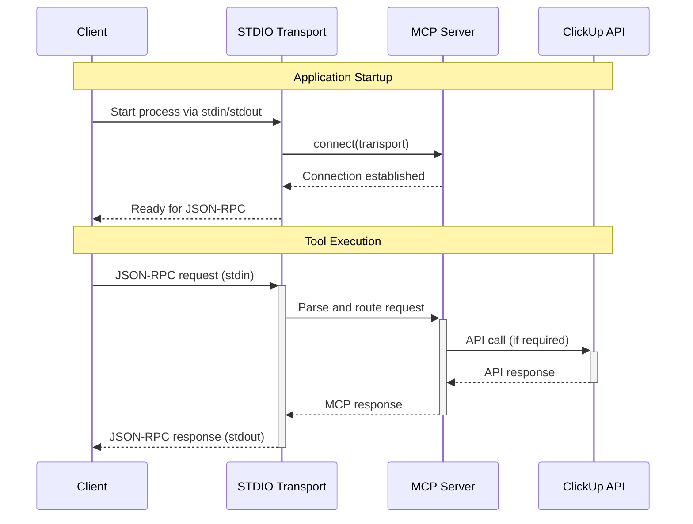
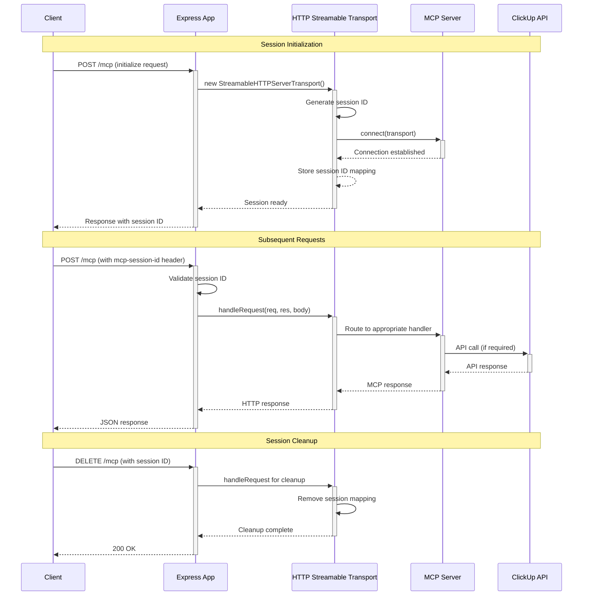
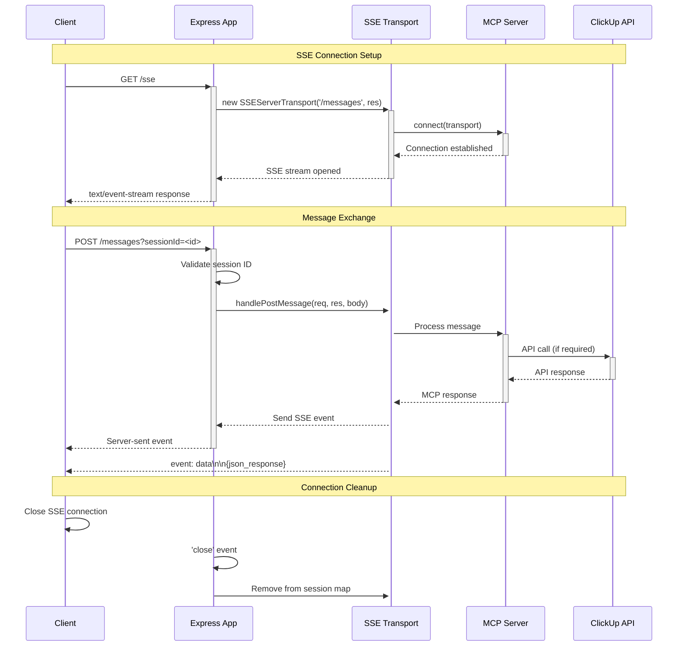

# ClickUp MCP Server Transport Catalogue

## Overview

The ClickUp MCP Server supports multiple transport mechanisms for client-server communication. This document catalogues all available transports, their startup paths, configuration flags, and request/response lifecycle.

## Conditional Startup Path Analysis

### Main Entry Point (`src/index.ts`)

The application entry point (`main()` function) conditionally selects between two primary startup paths:

```typescript
async function main() {
  try {
    if (config.enableSSE) {
      // Start the new SSE server with HTTP Streamable support
      startSSEServer();
    } else {
      // Start the traditional STDIO server
      await startStdioServer();
    }
  } catch (err) {
    // Error handling...
  }
}
```

## Transport Mechanisms

### 1. STDIO Transport (Default)

**Startup Function**: `startStdioServer()`
**File**: `src/index.ts:51-72`
**Default**: Enabled (when `ENABLE_SSE=false` or unset)

#### Environment Flags:
- `ENABLE_SSE=false` (default) - Forces STDIO transport
- `ENABLE_STDIO=true` (default) - Explicitly enable STDIO transport

#### Implementation:
```typescript
async function startStdioServer() {
  // Configure the server with all handlers
  await configureServer();
  
  // Connect using stdio transport
  const transport = new StdioServerTransport();
  await server.connect(transport);
}
```

#### Communication Method:
- **Input**: Standard input (stdin) - JSON-RPC messages
- **Output**: Standard output (stdout) - JSON-RPC responses
- **Protocol**: Model Context Protocol over JSON-RPC 2.0

---

### 2. SSE/HTTP Transport Suite

**Startup Function**: `startSSEServer()`
**File**: `src/sse_server.ts:34-317`
**Activation**: `ENABLE_SSE=true`

#### Environment Flags:
| Flag | Default | Purpose |
|------|---------|----------|
| `ENABLE_SSE` | `false` | Enable SSE/HTTP transport suite |
| `PORT` | `3231` | HTTP server port |
| `SSE_PORT` | `3000` | Legacy SSE port (deprecated) |
| `ENABLE_HTTPS` | `false` | Enable HTTPS server |
| `HTTPS_PORT` | `3443` | HTTPS server port |
| `SSL_KEY_PATH` | - | SSL private key file path |
| `SSL_CERT_PATH` | - | SSL certificate file path |
| `SSL_CA_PATH` | - | SSL CA certificate file path (optional) |

#### Sub-Transports:

##### 2a. HTTP Streamable Transport (Primary)

**Endpoints**:
- `POST /mcp` - Main communication endpoint
- `GET /mcp` - Session-based requests
- `DELETE /mcp` - Session cleanup

**Expected Payload Format**:
```json
{
  "jsonrpc": "2.0",
  "method": "tools/call",
  "params": {
    "name": "tool_name",
    "arguments": { /* tool-specific arguments */ }
  },
  "id": 1
}
```

**Required Headers**:
- `Content-Type: application/json`
- `mcp-session-id: <session_id>` (for subsequent requests)

**Session Management**:
- Session ID generated on first initialize request
- Format: `session_${timestamp}_${random}`

##### 2b. Legacy SSE Transport (Backward Compatibility)

**Endpoints**:
- `GET /sse` - Establish SSE connection
- `POST /messages?sessionId=<id>` - Send messages

**Expected Payload Format**:
Same JSON-RPC 2.0 format as HTTP Streamable

##### 2c. Health Check Endpoint

**Endpoint**: `GET /health`
**Response Format**:
```json
{
  "status": "healthy",
  "timestamp": "2025-01-27T10:30:00.000Z",
  "version": "0.8.3",
  "security": {
    "featuresEnabled": false,
    "originValidation": false,
    "rateLimit": false,
    "cors": false
  }
}
```

---

### 3. HTTPS Transport (Optional Enhancement)

**Activation**: `ENABLE_HTTPS=true`
**Requirements**: SSL certificate files must exist
**Behavior**: Runs alongside HTTP server (both active simultaneously)

#### SSL Configuration:
- **Private Key**: `SSL_KEY_PATH` environment variable
- **Certificate**: `SSL_CERT_PATH` environment variable  
- **CA Certificate**: `SSL_CA_PATH` environment variable (optional)
- **Port**: `HTTPS_PORT` (default: 3443)

#### Endpoints (HTTPS versions):
- `https://127.0.0.1:3443/mcp`
- `https://127.0.0.1:3443/sse`
- `https://127.0.0.1:3443/health`

---

## Security Configuration

### Optional Security Features

All security features are **opt-in** for backward compatibility:

| Feature | Environment Variable | Default | Description |
|---------|---------------------|---------|-------------|
| Security Features | `ENABLE_SECURITY_FEATURES` | `false` | Master security toggle |
| Origin Validation | `ENABLE_ORIGIN_VALIDATION` | `false` | Validate Origin header |
| Rate Limiting | `ENABLE_RATE_LIMIT` | `false` | Request rate limiting |
| CORS | `ENABLE_CORS` | `false` | Cross-origin resource sharing |

#### Rate Limiting Configuration:
- `RATE_LIMIT_MAX=100` (requests per window)
- `RATE_LIMIT_WINDOW_MS=60000` (60 seconds)

#### Allowed Origins (when origin validation enabled):
```
http://127.0.0.1:3231, http://localhost:3231
http://127.0.0.1:3000, http://localhost:3000  
https://127.0.0.1:3443, https://localhost:3443
https://127.0.0.1:3231, https://localhost:3231
```

Override with: `ALLOWED_ORIGINS="origin1,origin2,origin3"`

#### Request Size Limits:
- `MAX_REQUEST_SIZE=10mb` (default)
- Hard limit: 50MB (enforced by input validation middleware)

---

## Request/Response Lifecycle Sequence Diagrams

### STDIO Transport Lifecycle



### HTTP Streamable Transport Lifecycle



### Legacy SSE Transport Lifecycle



### HTTPS Transport Security Flow

```mermaid
sequenceDiagram
    participant Client
    participant SecurityMW as Security Middleware
    participant Express as Express App
    participant Transport as Transport Layer
    
    Note over Client,Transport: Security Validation Chain
    Client->>+SecurityMW: HTTPS Request
    SecurityMW->>SecurityMW: Input validation (size limits)
    SecurityMW->>SecurityMW: Security logging
    SecurityMW->>SecurityMW: Security headers
    SecurityMW->>SecurityMW: CORS validation (if enabled)
    SecurityMW->>SecurityMW: Origin validation (if enabled)
    SecurityMW->>SecurityMW: Rate limiting (if enabled)
    
    alt All validations pass
        SecurityMW->>+Express: Forward request
        Express->>+Transport: Process normally
        Transport-->>-Express: Response
        Express-->>-SecurityMW: Response with security headers
        SecurityMW-->>-Client: Secured HTTPS response
    else Validation fails
        SecurityMW-->>-Client: 403/429/413 Error Response
    end
```

---

## Server Startup Configuration Matrix

| Configuration | STDIO Only | HTTP Only | HTTPS Only | HTTP + HTTPS |
|---------------|------------|-----------|------------|--------------|
| `ENABLE_SSE` | `false` | `true` | `true` | `true` |
| `ENABLE_HTTPS` | N/A | `false` | `true` | `true` |
| SSL Certificates | N/A | N/A | Required | Required |
| Ports Used | None | 3231 (HTTP) | 3443 (HTTPS) | 3231, 3443 |
| Transport Types | STDIO | HTTP Streamable, Legacy SSE | HTTPS Streamable, Legacy SSE | Both HTTP and HTTPS variants |

---

## Tool Execution Flow

Regardless of transport mechanism, all tool executions follow this pattern:

1. **Request Validation**: Transport-specific parsing and session validation
2. **Tool Routing**: Server routes to appropriate tool handler based on tool name
3. **Tool Filtering**: Check if tool is enabled via `ENABLED_TOOLS`/`DISABLED_TOOLS`
4. **Execution**: Call tool handler with parsed parameters
5. **Response Formatting**: Convert result to transport-appropriate response format
6. **Error Handling**: Transform exceptions to JSON-RPC error responses

Available tools: 36 total across categories: workspace, task, time-tracking, list, folder, tag, member, document

---

## Environment Variables Summary

### Core Configuration
- `CLICKUP_API_KEY` (required)
- `CLICKUP_TEAM_ID` (required)
- `DOCUMENT_SUPPORT=false` (optional document tools)
- `LOG_LEVEL=ERROR` (TRACE, DEBUG, INFO, WARN, ERROR)

### Transport Selection
- `ENABLE_SSE=false` (primary transport selector)
- `ENABLE_STDIO=true` (explicit STDIO control)

### HTTP/HTTPS Configuration  
- `PORT=3231` (HTTP port)
- `HTTPS_PORT=3443` (HTTPS port)
- `ENABLE_HTTPS=false` (HTTPS server toggle)
- `SSL_KEY_PATH`, `SSL_CERT_PATH`, `SSL_CA_PATH`

### Security (All Optional)
- `ENABLE_SECURITY_FEATURES=false`
- `ENABLE_ORIGIN_VALIDATION=false`
- `ENABLE_RATE_LIMIT=false`
- `ENABLE_CORS=false`
- `ALLOWED_ORIGINS` (comma-separated list)
- `RATE_LIMIT_MAX=100`, `RATE_LIMIT_WINDOW_MS=60000`
- `MAX_REQUEST_SIZE=10mb`

### Tool Filtering
- `ENABLED_TOOLS` (comma-separated, takes precedence)
- `DISABLED_TOOLS` (comma-separated, used if ENABLED_TOOLS not set)
